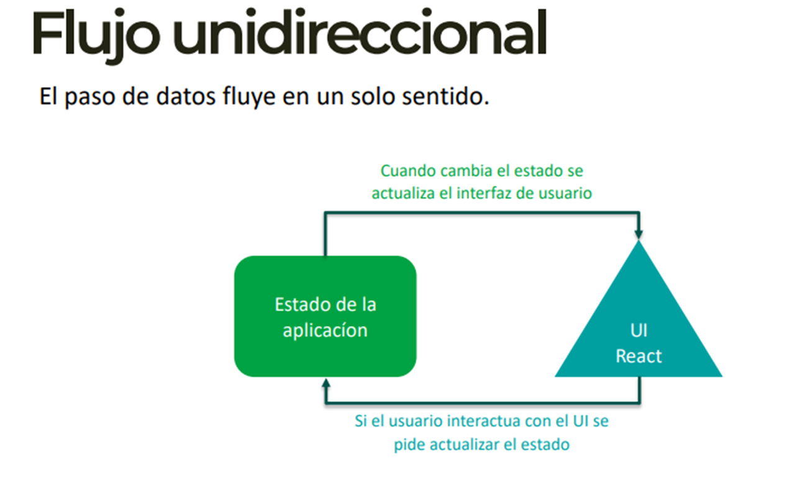
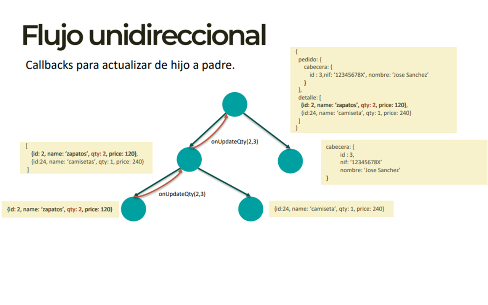

# React cambio de Chip

+ Los componentes de React se basan en funciones.
+ Las actualizaciones en React son asíncronas.
+ El estado de React es inmutable.
+ Queremos desarrolar aplicaciones robustas y con buen rendimiento.
+ Esto supone aprneder algo nuevo y un cambio de forma de pensar.
*****
# Funcional
Con la introducción de Hooks se ha pasado a desarrollar con una aproximación funcional.

+ Los componentes de tipo clase se han queado como Legacy.
+ Podemos tener estado en componentes funcionales vía Hooks. La función se ejecuta y se muere, tenemos que tener una forma de guardar esos datos en algun lugar.
+ No existe la herencia. En ciertas cosas se considera mala prácticar la herencia.
+ A la hora de reusar funcionalidad se prima la composición, yo uso otros componentes.
+ Es un cambio de paradigma para los que vienen de tecnologías como .net, java.
*****
# Ejemplo Componente

```
import React from 'react';

export const MyComponent = props => {

  return (
    <>
      <h4>{myName}</h4>
      <input
      value = {myName}
      onChange={(e) => setMyName(e.target.value)}
      />
    </>
  )
}
```

+ Un componente es una función, que se ejecuta y se destruye.
+ useState hace que persistan los datos después de destruirse la función.
+ Un componente de tipo función devuelve un trozo de JSX.
****
# Inmutabilidad

Nunca modificamos un objeto o estructura, si necesitamos hacer una modificación, creamos un objeto nuevo.

+ Un objeto se puede usar en varios sitios, si lo mutamos, estamos cambiando sin avisar ¿ Os imagináis que mutáis por error un campo descuento que afecta a toda la aplicación ?.

+ Si muto un objeto de datos asociado a un componente ¿ Cómo se que tengo que repintar el componente? ¿Comparando una a una sus propiedades y subpropiedades?

+ Si mis objetos son inmutables mi aplicación es predecible, y para saber si ha habido alguna modificación sólo tengo que comparar el punturo de un objeto.

+ Trabajar con inmutabilidad no es fácil, algunas ayudas: immer, deepfreeze.
*****
# Asincronía

En React podemos pedir que se actualice el estado de nuestro componente, pero es el propio motor de React el que decide cuando aplicar esos cambios.

```
import React from "react";

export const MyComponent = () => {
  const [name, setName] = React.useState('John');

React.useEffect(() => {
  console.log(name); // John
  setName('Mary’);
  console.log(name); // John
},[])

  return (
    <h2>Hello {name}</h2>
  )
}
```

+ Esto de primeras puede añadir complejidad a nuestro desarrollo.
+ La naturaleza de una aplicación real es asíncrona (por ejemplo una llamada a servidor).
+ React optimiza el renderizado.
+ Puede llegar a agrupar varios setState en un solo render.
+ Nos obliga a cambiar de mentalidad.
**********


+ Cuando cambia el estado se actualiza el interfaz de usuario. Solo va en una dirección, no puedo cambiar desde React directamente el estado. 
+ Tengo que decirle a React que quiero cambiar el estado, tu defines si lo cambias o no lo cambias y es React quién los cambia y los manda para abajo.
+ La ventaja es que lo tienes todo más ordenado.

#### Callbacks para actualizar de hijo a padre.


+ Si vamos para abajo solo es Read, si quisieramos cambiar la cantidad de los zapatos a 2 tendríamos que subir hasta arriba en el detalle cambiar el qty:2 y entonces otra vez bajaría hacía abajo con los callbacks.

*Vamos a hacer un ejemplo picando código*

+ Nos metemos en [Codesanbox](https://codesandbox.io/dashboard), cramos un Sandbox de React + Typescript.
+ Creamos un nuevo archivo llamado demo.tsx e copiamos esto.
```
import React from "react";

export const EditName = () => {
  return <h1>Hola</h1>
};
```
+ Ahora importamos el Componente en App.tsx

``import {EditName} from "./demo";``

*- El archivo quedaría:*

```
import * as React from "react";
import "./styles.css";
import {EditName} from "./demo";

export default function App() {
  return (
    <div className="App">
      <EditName />
    </div>
  );
}
```

+ Vamos a empezar a utilizar estados.

```
import React from "react";

export const EditName = () => {
  const miestado = React.useState('pepe');

  return <h1>Hola {miestado[0]}</h1>
};
```

+ Con useState creamos un Array con destructuring en la posición 0 ponemos el getter y en la 1 ponemos el setter.

```
import React from "react";

export const EditName = () => {
  const [name, setName] = React.useState('pepe');

  return (
    <>
      <h1>Hola {name}</h1>
      <input value={name} />
    </>
  )
};
```
+ En el input no me dejaría poner nada porque cuando  tecleas, flujo unidireccional, fuerzas un repintar y nombre sigue valiendo pepe, tienes que llamar al setStage para modificar algo en el evento onChange, *las llaves, {} quiere decir que vas a empezar a picar JavaScript*, y llamamos al evento y llamos ahí al setName y le decimos que nos pinte el e.target.value. De esta forma ya nos deja modificar el input.

```
import React from "react";

export const EditName = () => {
  const [name, setName] = React.useState('pepe');
  const [lastName, setlastName] = React.useState('martinez');

  return (
    <>
      <h1>Hola {name} {lastName}</h1>
      <input value={name} 
      onChange = {(e) => setName(e.target.value)}
      />
      <input value = {lastName}
      onChange = {(e) => setlastName(e.target.value)}
      />
    </>
  )
};
```


