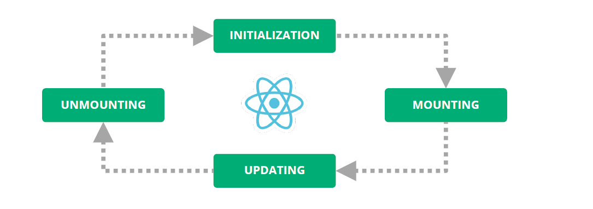

># Componentes, Hooks,....

>## Librería vs Framework

React es una librería, Angular es un Framework.

+ Una Librería tu código usa una librería.
+ En un Framework tu código es un framework, te da una solución a todo. Te dice como se hace, como lo tienes que hacer y como lo tienes que usar.
----
>## JSX

No es HTML, No es un string... es azúcar en XML que se traduce a JavaScript.

```
<h2>Hello from React</h2>

Por dentro se convierte a

-react.default.createElement("h2", null, "Hello from React"),
```
---
>## Componentes
Los componentes en React son funciones (*=>recordamos class component legacy). 
```
export const HelloComponent = (props) => {
  return <h2>Hello {props.name}</h2>
}
```
+ Son funciones que se ejecutan y mueren una y otra vez en cada render.
+ Devuelve siempre React Elements.
+ Me permiten dividir el UI en piezas independientes y reusables.
+ Los componentes son piezas aisladas.
+ Puedo hacer composición de componentes.
+ Exponen un contrato (props) para interactuar.

>#### Propiedades 

Las propiedades definen un contrato que permite que otros componentes puedan consumir un componente que hayamos creado e interactuar con él. Es decir, tengo unas propiedades y referencio via *props.name*. 

```
interface Props {
  name: string;
}

export const HelloComponent = (props: Props) => {
  return <h2>Hello {props.name}</h2>;
}
```

+ Se alimentan de padre a hijo
+ Son de sólo lectura.
+ La definición de propiedades se lleva muy bien con TypeScript.
+ ¿Cómo informo de hijo a padre? Pasamos propiedades de tipo función, de tipo callback.

```
interface Props {
  name: string;
  onChangeName: (newname: string) => void;
}

export const NameEdit = (props: Props) => {
  return (
    <input
      value={props.name}
      onChange={e => props.onChangeName(e.target.value)}
    />
  );
};
```
+ En el onChangeName lanzo la función en el componente padre, puedo decidir si pongo el nombre o no lo pongo.

+ Si creamos un componente suegra y tenemos un componente yerno que depende de ella. Tenemos que definir en el yerno un interface donde tenga una propiedad que se una función e invocar desde la suegra a la propiedad de esa función para que nos deje modificarla.

```
import React from "react";

interface Props {
  nombre: string;
  onNuevoNombre: (nuevoNombre:string) => void;
  }
  
export const Yerno = (props: Props) => {
    return (
      <>
        <h1>{props.nombre}</h1>
        <input value ={props.nombre} 
        onChange={(e) => props.onNuevoNombre(e.target.value)}
        />
      </>
    )
  }

export const Suegra = () => {
  const [nombre, setNombre] = React.useState('Carlos');

  return (
    <Yerno nombre = {nombre} onNuevoNombre= {setNombre} />
    
  )
}
```
Me he creado el componente suegra, el componente suegra tiene el nombre y el setNombre. Me da un nombre inicial que me aconseja llamarlo Carlos y me da aquí un setNombre el componente yerno, pongo props.nombre que es lo que recibo en el props, pero yo no puedo cambiarle el nombre directamente al niño. Que hago, mi suegra me da un setNombre y yo lo que tengo que hacer en las propiedades crearme una entrada para yo poder y llamar a esa función. Él me pasa un nuevo nombre por propiedades en el onchange no puedo cambiar el nombre directamente pero si puedo llamar a props.onNuevo nombre pero si pasarle por los paréntesis un nuevo nombre. Lo que hace esa llamada está llamando a setNombre de suegra y no tiene potestad para cambiarlo. Para que suegra tenga potestad y no me deje cambiar el Yerno el nombre se pondría así.

```
import React from "react";

interface Props {
  nombre: string;
  onNuevoNombre: (nuevoNombre: string) => void;
}

export const Yerno = (props: Props) => {
  return (
    <>
      <h1>{props.nombre}</h1>
      <input
        value={props.nombre}
        onChange={(e) => props.onNuevoNombre(e.target.value)}
      />
    </>
  );
};

export const Suegra = () => {
  const [nombre, setNombre] = React.useState("Carlos");

  const setNombreLoQueYoDiga = (nuevoNombre: string) => {
    if (nuevoNombre === "Carlos" || nuevoNombre === "arlos") {
      setNombre(nuevoNombre);
    } else {
      console.log("Muahhhhh antes muerta que ponerle ese nombre!!");
    }
  };

  return <Yerno nombre={nombre} onNuevoNombre={setNombreLoQueYoDiga} />;
};
```
---
>#### Propiedades - callback
Informando de hijo a padre
```
interface Props {
  name: string;
  onChangeName: (newname: string) => void;
}

export const NameEdit = (props: Props) => {
  return (
    <input
      value={props.name}
      onChange={e => props.onChangeName(e.target.value)}
    />
  );
};
```
+ Tengo como propiedad un callback(función).
+ En cada cambio del input invoco dicha función.
+ La función se ejecuta en el componente padre.
+ El componente padre tiene control de cuando se ejecuta.
---
>#### Estado
Nos permite almacenar información de lectura y escritura.
```
export const MyComponent = () => {
  const [name, setName] = React.useState('John');

  return <input value={name} onChange={e => setName(e.target.value)} />;
};
```
+ useState me permite persistir datos más alla de la muerte de la función.
+ La asignación de valor es asíncrona.
+ UseState me permite almacenar tanto tipos simples como objetos.
+ Si manejo estructuras inmutable en el estado, se pueden hacer optimaziones.
+ useState se basa en la tecnología de Hooks.
+ Antes de usar Hooks hay que saber bien como funcionan.
---
>#### Ciclo de vida de un componente
Todo en este mundo sigue un ciclo, por ejemplo los humanos o las plantas. Nacemos, crecemos y morimos. React no iba a ser menos...
Los componentes se crean (se montan en el DOM), se actualizan("crecen"), y mueren(se liberan del DOM). A esto le llamamos ciclo de vida de un componente.


>#### Manejo de datos comunes
Cuando desarrollamos una aplicación podemos encontrarnos con datos que son transversales a la misma, e ir pasándolos de padre a hijo sucesivamente puede impactar en la calidad y mantenibilidad de nuestro código.
1:26'


